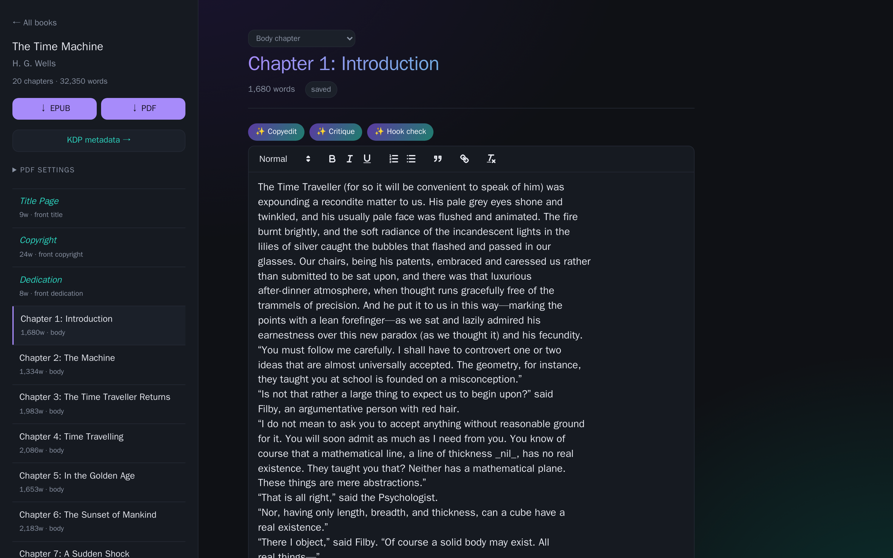
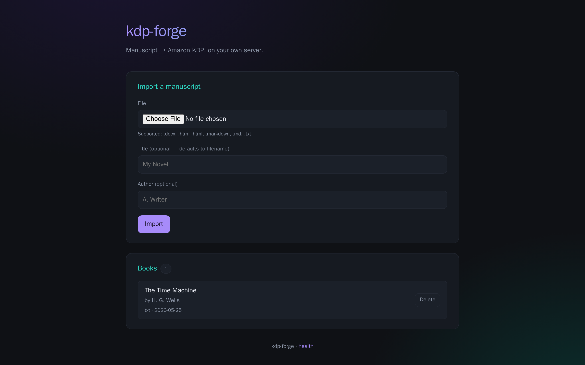
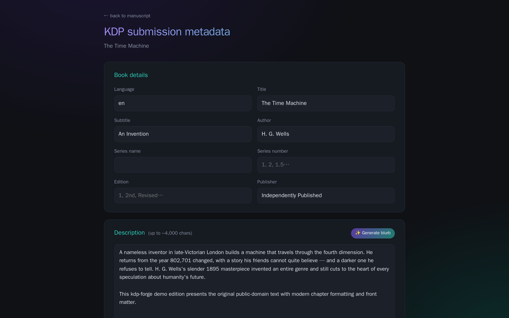

# kdp-forge

> A self-hosted book editor + Amazon KDP packager. Reedsy Studio's writing & export workflow, focused on the *self-publish to KDP* path, with local AI editorial assist (Ollama). Zero per-use cost.

<p align="center">
  
</p>

## Why

Reedsy Studio is great, but it's cloud-hosted, paywalled for parts of the workflow, and not actually focused on the Amazon KDP submission step at the end. **kdp-forge** strips it to the parts that matter for a solo self-publishing author:

1. Import your manuscript from whatever format you wrote it in
2. Edit it in a clean web editor with autosave and snapshots
3. Get developmental + line-edit feedback from a local LLM
4. Export EPUB 3 + a print-ready PDF at any KDP trim size
5. Get a paste-ready bundle of every field KDP's upload form wants

Everything runs on your own server. Your manuscripts never leave your network. AI calls go to local Ollama — no API keys, no usage fees, no Reedsy subscription.

## One-line install

On any host with Docker + git:

```bash
curl -fsSL https://raw.githubusercontent.com/frogswiper/kdp-forge/main/install.sh | bash
```

That clones the repo into `~/kdp-forge`, writes a default `.env`, builds the containers, and starts the service on `https://localhost:2005`. Override host/port via env:

```bash
curl -fsSL https://raw.githubusercontent.com/frogswiper/kdp-forge/main/install.sh \
  | SITE_HOST=192.168.1.20 SITE_PORT=2005 bash
```

## What's inside

| Layer | Stack |
|---|---|
| Web | FastAPI 0.115 + Uvicorn (Python 3.12) |
| UI | Server-rendered Jinja2 + vanilla JS + [Quill 2.x](https://quilljs.com) for the editor |
| Storage | SQLite via SQLAlchemy 2 (async) |
| Reverse proxy | Caddy 2 with `tls internal` (self-signed cert) |
| Import | `python-docx`, `markdown-it-py`, `beautifulsoup4`, `bleach` |
| Export | `ebooklib` (EPUB 3), `WeasyPrint` 63 (PDF) |
| AI | Local [Ollama](https://ollama.com) — any model; default `gemma4:31b-cloud` |
| Packaging | Two-container Docker Compose (app + caddy) |

No external API keys. No background services beyond Ollama and Docker.

---

## Full functionality

### 1. Import — any source format, normalized chapter structure

Drag-and-drop a manuscript file. kdp-forge parses it into a normalized list of chapters and persists them as editable records.

| Format | Chapter detection |
|---|---|
| `.docx` | Splits on `Heading 1` (falls back to `Heading 2`); bold/italic runs preserved |
| `.md` / `.markdown` | Splits on `#` headings (falls back to `##`) |
| `.html` / `.htm` | Splits on `<h1>` (falls back to `<h2>`); scripts/styles stripped |
| `.txt` | Recognizes "Chapter N" / "Chapter [roman]" / numbered headings, fully-uppercase short lines, and named sections (Copyright, Dedication, etc.) |

**Front-matter is auto-classified.** A chapter titled "Copyright" gets `kind=front_copyright`, "Dedication" → `front_dedication`, "About the Author" → `back_about`, and so on. The kind drives how each chapter renders in the EPUB and PDF (front matter is unnumbered and headerless; body chapters get running heads and page numbers).

All imported HTML is sanitized through `bleach` — only semantic tags survive (`p`, `em`, `strong`, `blockquote`, `ul`, `ol`, `li`, `h1`-`h6`, `a`, `code`, `pre`). The raw upload is also persisted to `data/imports/` in case you need to re-import.

### 2. Edit — Quill, autosave, snapshots, live word count

The book view is a three-column layout: **chapter sidebar** (with each chapter's word count and kind), **Quill 2.x editor** in the middle, and a header strip with the chapter title (inline-editable), kind selector, and save status.

- **Autosave** debounces 1.5s after you stop typing. The status pill cycles `editing… → saving… → saved` so you always know where you stand.
- **Word counts** update live across three places: current chapter, sidebar entry, book total.
- **Snapshots** in the sidebar give you Reedsy's "Timeline view" equivalent: take a labeled snapshot of the whole book before risky edits, restore any past snapshot with one click. Restoring *also creates an auto pre-restore snapshot* so the restore itself is undoable.
- A **beforeunload guard** stops you from navigating away with unsaved changes.

### 3. Metadata — every field KDP asks for, plus AI to fill the hard ones

The `/books/<slug>/metadata` page is a one-pager covering the full KDP upload form:

- **Book details:** title, subtitle, series (name + number), edition, author, language
- **Description:** textarea with live 4,000-char counter
- **Keywords:** 7 phrase-style entries, line-separated
- **BISAC categories:** up to 3, real BISAC codes
- **Age & grade range:** optional, for children's books
- **Content rating:** adult-content flag
- **Identifiers:** ISBN (optional — leave blank to use KDP's free assignment), publication date
- **Rights:** public-domain flag

Each section that benefits from an LLM has a **✨ AI Assist** button:

- **Generate blurb** — returns three blurb candidates (~200 / ~500 / ~1200 chars). Pick one to drop into the description field.
- **Suggest keywords** — returns 7 reader-search phrase keywords with rationale. Checkbox UI lets you pick what you want.
- **Suggest BISAC** — returns 5 ranked real BISAC codes (e.g. `FIC019000 LITERARY`) with one-line reasoning.

### 4. Export EPUB 3 — passes epubcheck

The `↓ EPUB` button in the sidebar builds a fully-valid EPUB 3 via `ebooklib`:

- Spine ordered: **front matter → body chapters → back matter** (each block in import order)
- Navigation document + NCX
- Embedded stylesheet: Georgia serif, justified body, centered chapter titles, `* * *` rendered for `<hr>` scene breaks
- Metadata block: title, author, language, UUID identifier (description if you've added a subtitle)

**Validated against epubcheck 5.1.0 (EPUB 3.3): 0 errors, 0 warnings, 0 infos.**

### 5. Export print PDF — 13 KDP trim sizes, mirrored gutters, running headers

The `↓ PDF` button takes a trim size and an estimated page count, then builds a print-ready PDF via WeasyPrint:

| Trim sizes available |
|---|
| 5×8 · 5.06×7.81 · 5.25×8 · 5.5×8.5 · **6×9 (default)** · 6.14×9.21 (A5) · 6.69×9.61 · 7×10 · 7.44×9.69 · 7.5×9.25 · 8×10 · 8.5×8.5 · 8.5×11 |

For each book:
- **Mirrored gutters.** The inside-spine margin is sized from KDP's official table (`gutter_for(page_count)` in `app/exporters/pdf.py`): 0.375" for ≤150 pages, up to 0.875" for 700+. Outside margin is 0.5", top/bottom 0.75".
- **Running headers.** Verso (left) pages get the *book title* in italic top-left. Recto (right) pages get the *chapter title* in italic top-right. Implemented via CSS `string-set` + `string()` so the values follow real chapter boundaries.
- **Page numbers** centered in the bottom margin.
- **Front matter and chapter-opener pages** are headerless (named `@page` rules).
- **Chapters start on the recto** (`page-break-before: right`).
- **Scene breaks** (`<hr>`) render as centered `* * *`.

Output is exact-trim: a 6×9 PDF reports `432pt × 648pt` MediaBox.

### 6. KDP submission bundle — paste-ready

From the metadata page, two buttons:

- **↓ JSON bundle** (`kdp-submission.json`) — fully structured payload (use for diffing across versions or scripting)
- **↓ Markdown bundle** (`kdp-submission.md`) — human-readable, section-by-section, with field labels that match KDP's upload form labels exactly. Open it side-by-side with KDP and paste field by field.

### 7. AI editorial assist — local Ollama, no external calls

Three chapter-level tools live in a toolbar above the editor:

- **✨ Copyedit** — proposes up to 12 specific line edits with `original → suggestion → reason`. Each has an *Apply* button that does the replacement in Quill (and triggers an autosave). Designed to be conservative — if the chapter is clean, you get zero edits.
- **✨ Critique** — structured developmental feedback across **hook / pacing / dialogue / ending**, each with a one-sentence verdict, 2-3 concrete observations citing snippets, and a suggestion. Plus an overall 1-10 score and a two-sentence summary.
- **✨ Hook check** — scores the chapter opening 1-10, lists what's working, lists what could be sharper, and writes 3 alternative first lines that preserve voice.

All AI calls run against your local Ollama. Default model `gemma4:31b-cloud`; switch via the `OLLAMA_MODEL` env var or per-call `{"model": "..."}` payload. Models work out of the box if they're listed by `GET /api/ai/models`.

---

## URLs you'll use

```
/                              home — upload form + book list
/books/<slug>                  editor + sidebar + snapshots
/books/<slug>/metadata         KDP metadata form + AI assist
/api/books/<slug>/export.epub  EPUB 3 download
/api/books/<slug>/export.pdf   PDF download — ?trim=6x9&pages=200
/api/books/<slug>/kdp-submission.json   structured metadata
/api/books/<slug>/kdp-submission.md     paste-ready metadata
/api/ai/models                 list available Ollama models
/health                        liveness check
```

All endpoints accept/return JSON. See `app/main.py` for the full route list (chapter PATCH, snapshot create/restore/delete, chapter-level AI tools).

## Running

Quick start:
```bash
git clone https://github.com/frogswiper/kdp-forge.git
cd kdp-forge
cp .env.example .env
# edit .env if you want a non-default host/port/model
docker compose up -d --build
```

Visit `https://<your-host>:2005` (default `localhost:2005`).

### Configuration

All config lives in `.env`:

| Var | Default | What it controls |
|---|---|---|
| `SITE_HOST` | `localhost` | Hostname/IP for the Caddy site (must match what you type in the browser) |
| `SITE_PORT` | `2005` | Port Caddy listens on |
| `OLLAMA_URL` | `http://host.docker.internal:11434` | Ollama HTTP endpoint as seen from inside the container |
| `OLLAMA_MODEL` | `gemma4:31b-cloud` | Default model for AI tools |

### Ollama bind on Linux hosts

If you're running Ollama via systemd on Linux, it binds to `127.0.0.1` by default and the kdp-forge container can't reach it. One-time fix:

```ini
# /etc/systemd/system/ollama.service.d/override.conf
[Service]
Environment="OLLAMA_HOST=0.0.0.0"
```

Then `sudo systemctl daemon-reload && sudo systemctl restart ollama`. Verify with `ss -tlnp | grep 11434` → should show `*:11434`.

## Project layout

```
kdp-forge/
├── docker-compose.yml      # app + caddy
├── Caddyfile               # tls internal, env-templated host/port
├── Dockerfile              # python:3.12-slim + pango/cairo for WeasyPrint
├── install.sh              # curl-able installer
├── .env.example
├── app/
│   ├── main.py             # FastAPI entrypoint + routes
│   ├── db.py               # SQLAlchemy models + lightweight migrations
│   ├── importers/          # txt.py / md.py / html.py / docx.py + common.py
│   ├── exporters/          # epub.py / pdf.py / kdp_meta.py
│   ├── ai/                 # client.py (Ollama HTTP) + prompts.py
│   ├── templates/          # Jinja2: index, book (editor), metadata
│   └── static/             # style.css + editor.js
└── data/                   # bind-mounted to /data — kdp-forge.db lives here
```

## Screenshots

<p align="center">
  
  <br>
  <em>Home — upload + book list</em>
</p>

<p align="center">
  
  <br>
  <em>Metadata page — full KDP fields with AI assist</em>
</p>

## Known limitations

- **WeasyPrint won't reset `counter(page)` on flow elements**, so PDF page numbering runs continuous arabic across the whole book (no roman numerals on front matter). Many trade books do this; if you need roman numerals, that's a future fix using named-page tricks.
- **Cloud Ollama models** (`*-cloud` suffix) need internet on the host. If you're offline, switch `OLLAMA_MODEL` to a local model.
- **Single-user, LAN-only.** No auth, no multi-tenancy, no real-time collaboration. That's intentional — keeps the threat model trivial and the codebase small.
- **No direct KDP upload.** Amazon doesn't publish a KDP API. You still copy-paste the metadata bundle into their web form yourself. The bundle just makes that step a 90-second job instead of 20 minutes of context-switching.

## Roadmap ideas (not committed)

- Cover designer (templates + image upload + per-trim cover wrap PDF)
- ISBN tracker for multi-format / multi-edition publishing
- Translation pipeline (chapter-level → re-export per language)
- Streaming AI responses for the longer copyedit / critique runs
- Two-pass PDF that auto-detects the real page count and re-renders with the right gutter

## License

MIT — see [LICENSE](LICENSE).

Built by [frogswiper](https://github.com/frogswiper). Modeled on [Reedsy Studio](https://reedsy.com/studio) but standalone, self-hosted, and KDP-shaped.
